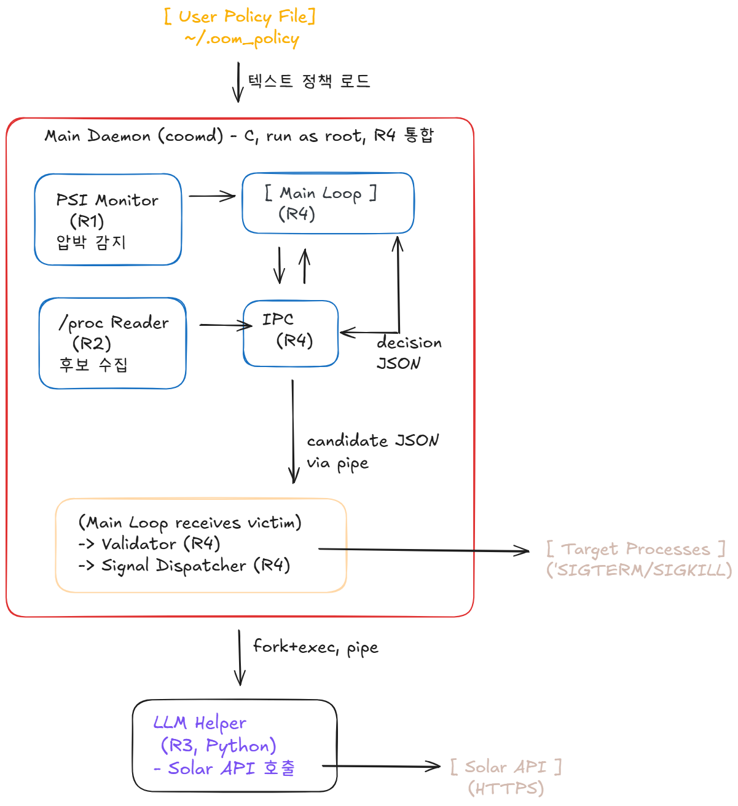

# Architecture

## Overview

Conversational OOM Killer는 리눅스 유저스페이스에서 동작하는 데몬으로,
PSI (Pressure Stall Information)를 통해 메모리 압박을 감지하고 사용자가
자연어로 작성한 정책에 따라 LLM이 victim 프로세스를 선택하도록 한다.

전체 구조

시스템은 크게 두 프로세스로 구성된다.

- **Main Daemon ('coomd')**: C로 작성된 root 권한 데몬. PSI 모니터링, '/proc' 인트로스펙션, IPC, victim 검증, 시그널 디스패치를 담당한다.
- **LLM Helper**: Python으로 작성된 자식 프로세. Main Daemon이 'fork' + 'exec'로 띄우고 'pipe'로 양방향 JSON 통신한다. Solar API를 호출하여 victim 추천을 받는다.

## Components

### 1. PSI Monitor (R1, C)
'/proc/pressure/memory'를 1초 주기로 폴링한다. 'some avg10' 값이 임계치 (기본 15.0%)를 초과하면 'pressure_event'를 발생시켜 Main Loop에 전달한다.

### 2. /proc Reader (R2, C)
이벤트 발생 시 모든 사용자 프로세스의 메타데이터를 수집한다. 각 PID에 대해 '/proc/[pid]/status' (VmRSS, Uid, PPid), 'cmdline', 'oom_score', 'cgroup'을 파싱한다. 커널 스레드는 'PPid == 2' 조건으로 필터링한다.

### 3. Main Loop (R4, C)
PSI 이벤트를 받아 후보 수집·IPC 호출·검증·디스패치를 조율한다. 이 시스템의 오케스트레이터

### 4. IPC (R4, C)
Python LLM Helper와의 통신을 담당한다. 데몬 시작 시 'fork'+'execlp'로 헬퍼를 띄우고, 두 개의 pipe(부모->자식, 자식->부모)로 양방향 통신 채널을 구성한다. 통신 프로토콜은 1줄 단위 JSON.

### 5. LLM Helper (R3, Pyhon)
별도 프로세스로 동작하며 stdin/stdout만 사용한다. 받은 후보 JSON과 사용자 정책 텍스트를 시스템 프롬프트와 함께 Upstage Solar Pro 3에 전달하고, 응답을 1줄 JSON으로 출력한다. OpenAI SDK 호환 인터페이스를 사용하며 'temperature=0', 'response_format=json_object'로 결정론적 응답을 강제한다.

### 6. Validator (R4, C)
LLM이 추천한 PID를 화이트리스트와 대조한다. PID 1, systemd, sshd, dbus-daemon, 그리고 데몬 자기 자신은 무조건 거부한다. LLM 응답을 신뢰하지 않는 안전 경계.

### 7. Signal Dispatcher (R4, C)
승인된 PID에 'SIGTERM'을 보내고 5초간 대기, 프로세스가 종료되지 않으면 'SIGKILL'로 에스컬레이션한다. 좀비 회수는 'waitpid(WNOHANG)'으로 처리.

## Data Flow

한 사이클은 아래 순서로 진행된다.

1. 'coomd'가 시작되며 '~/.oom_policy'를 메모리에 로드하고 LLM Helper를 'fork' + 'exec'로 띄운다.
2. PSI Monitor가 'some_avg10' 임계치 초과를 감지하면 콜백 호출.
3. Main Loop가 '/proc' Reader를 호출하여 후보 리스트 (JSON) 생성.
4. IPC가 후보 JSON + 정책 텍스트를 pipe로 LLM Helper에 송신.
5. LLM Helper가 Solar API 호출 후 victime 후보 JSON을 반환.
6. Validator가 화이트리스트 검증.
7. Signal Dispatcher가 SIGTERM -> 대기 -> SIGKILL.

### Design Choices

### C 데몬 + PYthon 헬퍼 분리
PSI, '/proc', 시그널 처리는 시스템 콜 중심이라 C로 작성하는 것이 자연스럽다. 반면 LLM API 호출은 HTTPS·JSON·SDK 의존성이 있어 Python이 훨씬 간결하다. 두 언어의 강점을 살리기 위해 프로세스를 분리하고 pipe로 통신한다. 이 분리 자체가 OS 개념(프로세스 생성·IPC)을 자연스럽게 활용한다.

### Validator를 LLM 외부에 배치
LLM이 잘못된 PID(예: PID 1)를 추천할 가능성을 차단하기 위해, 안전 검증은 결론적인 C 코드로 수행한다. LLM은 제안만, 결정은 OS가.

### 결정론적 LLM 응답
'temperature=0'과 JSON 강제 출력으로 같은 입력에 같은 응답을 보장한다.
디버깅·재현성·평가의 신뢰성을 위해 필수.
